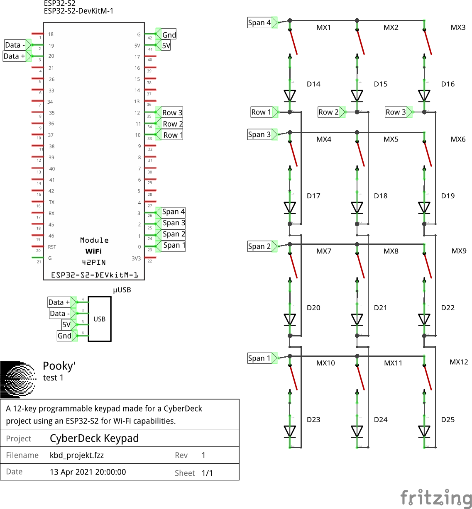

# CyberDeck KeyPad 
Simple 12-key programmable keypad using an ESP32-S2 for a CyberDeck project.

## Summary
- [Installation instructions](#installation-instructions)
- [Images](#images)
- [Sources](#sources)

### Installation Instructions
/!\ Under construction.

### Images

### Sources 
- [EspTinyUSB](https://github.com/chegewara/EspTinyUSB) by [Chegewara](https://github.com/chegewara)
- [arduino-esp32](https://github.com/espressif/arduino-esp32) by [Espressif](https://github.com/espressif)
- [ESP32-S2 USB demo using Arduino IDE](https://www.youtube.com/watch?v=l3MmrVHMd94&ab_channel=LucaDentella) by [Luca Dentella](https://www.youtube.com/channel/UCQewD5sQ1WsJCIAuOMZ2V2w)

